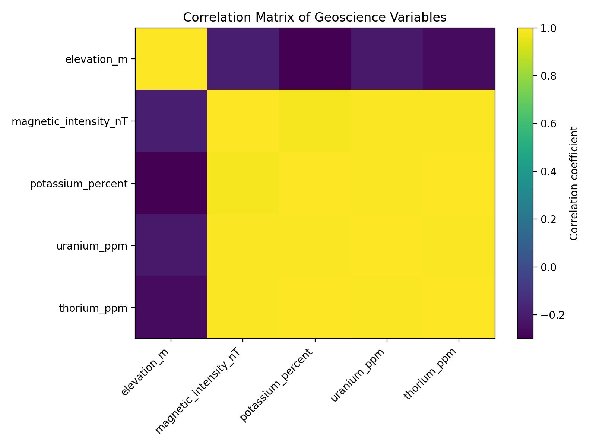
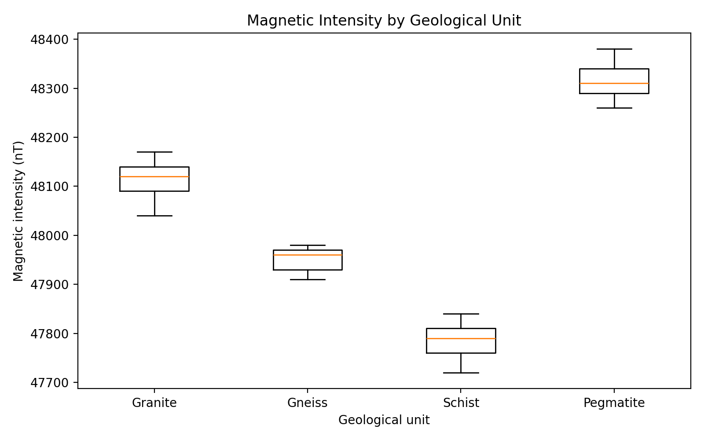
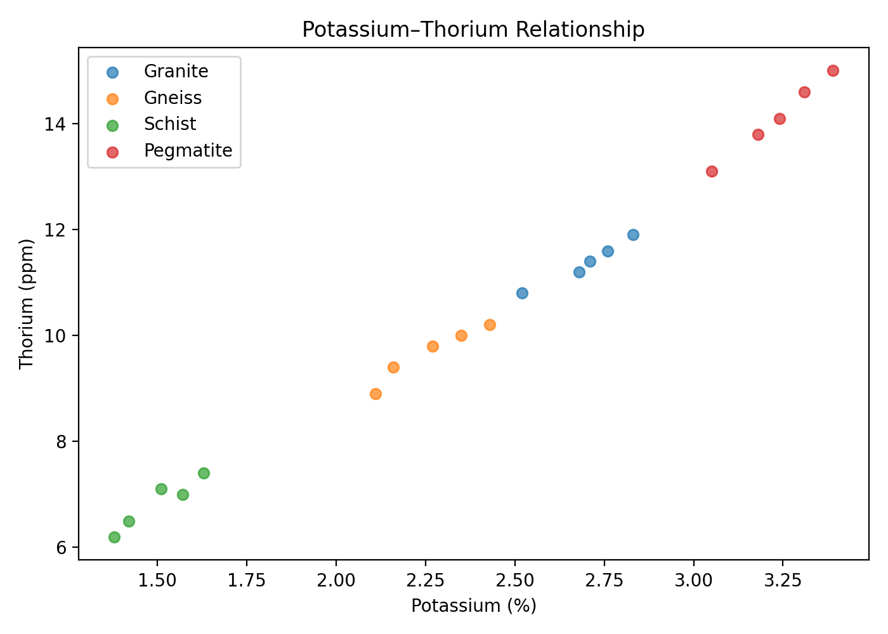

# Geological and Geophysical Data Analysis with Python

## Overview

This project demonstrates a reproducible Python workflow for the quality control, statistical analysis, visualization, and interpretation of geological and geophysical data.

The project uses a synthetic geoscience dataset representing measurements that may be encountered in geological and geophysical exploration workflows. It was developed as an independent portfolio project to demonstrate scientific data analysis and Python skills.

## Objectives

- Inspect and validate geoscience data
- Perform basic data quality checks
- Calculate descriptive statistics
- Explore relationships between geological and geophysical variables
- Compare measurements across geological units
- Produce scientific visualizations
- Document a reproducible analytical workflow

## Dataset

The synthetic dataset contains:

- Sample identifiers
- Latitude and longitude
- Elevation
- Magnetic intensity
- Potassium concentration
- Uranium concentration
- Thorium concentration
- Geological unit

The dataset is synthetic and does not contain confidential, proprietary, or restricted information.

## Tools and Technologies

- **Python**
- **Pandas** — data manipulation and analysis
- **Matplotlib** — data visualization
- **Jupyter/Google Colab** — analysis environment
- **GitHub** — version control and project documentation

## Analytical Workflow

The project follows these steps:

1. Load the geoscience dataset
2. Inspect the structure and data types
3. Check for missing and duplicate records
4. Calculate descriptive statistics
5. Group observations by geological unit
6. Calculate correlations between numerical variables
7. Generate geoscience visualizations
8. Document the analytical results

## Results and Visualizations

### 1. Correlation Matrix

The correlation matrix provides an exploratory view of relationships between the numerical variables in the synthetic dataset.



### 2. Magnetic Intensity by Geological Unit

This visualization compares magnetic intensity across the geological units represented in the dataset.



### 3. Potassium–Thorium Relationship

This scatter plot illustrates the relationship between potassium and thorium measurements across the geological units.



## Interpretation

The analysis demonstrates how geological and geophysical variables can be explored quantitatively using Python.

The visualizations provide examples of:

- Exploratory data analysis
- Geological-unit comparison
- Correlation analysis
- Geophysical data visualization
- Scientific interpretation

Because the dataset is synthetic, the observed relationships are intended to demonstrate analytical methods rather than represent real-world geological conclusions.

## Project Structure

```text
geoscience-data-analysis/
│
├── data/
│   └── geoscience_sample.csv
│
├── figures/
│   ├── correlation_matrix.png
│   ├── magnetic_by_geological_unit.png
│   └── potassium_thorium.png
│
├── src/
│   └── analysis.py
│
├── README.md
└── results.md

```
## Key Skills Demonstrated

* Scientific data analysis
* Data quality assurance and validation
* Exploratory data analysis
* Geoscience data interpretation
* Data visualization
* Python programming
* Reproducible analytical workflows
* Technical documentation
* Statistical analysis


## Author

**Omowunmi Kehinde**

Geoscientist | AI Training & Evaluation | Data Analysis | Scientific Research

[LinkedIn](https://www.linkedin.com/in/omowunmi-kehinde-5b222b251/)
